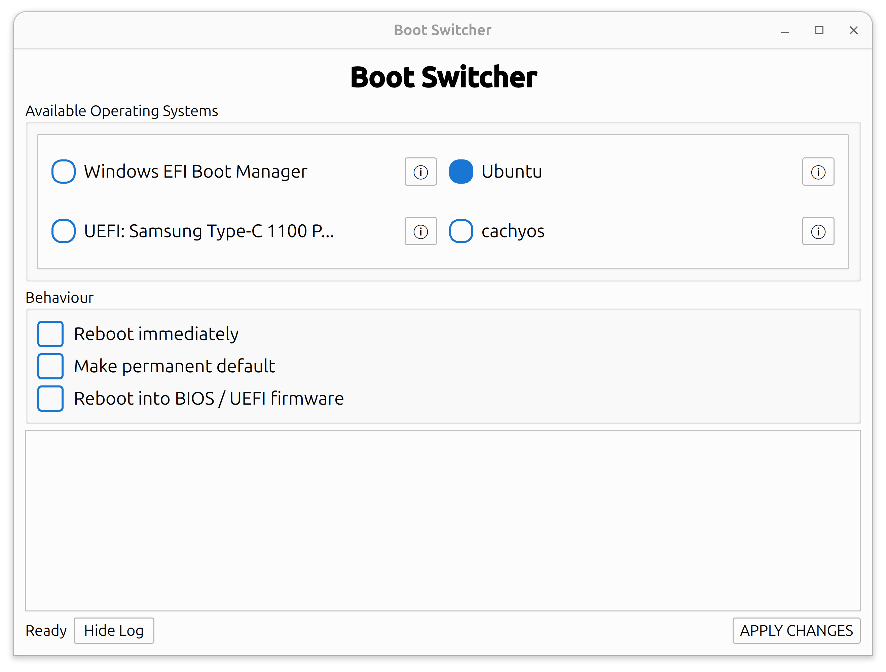

# Boot Switcher

Boot Switcher is a small Linux utility program for easily managing your boot entries and choosing what OS your computer boots into next. It is designed to be cross-distro compatible and works fully offline.

## Installation

```bash
curl -fsSL https://raw.githubusercontent.com/vale44/boot-switcher/main/install-boot-switcher.sh | sudo bash
```

Then launch it either with:

```bash
boot-switcher
```
Or run it from Applications or the Desktop Shortcut


### Uninstall

```bash
curl -fsSL https://raw.githubusercontent.com/vale44/boot-switcher/main/installer/uninstall.sh | sudo bash
```
or run uninstall.sh in the installer folder





## How it works

Boot Switcher detects the available UEFI boot entries and identifies the operating systems and bootable drives associated with them and lays them out in a visually appealing GUI.

It uses `efibootmgr` to read and modify the firmware boot order from there.

From the interface you can:

* Reboot your System
* Change the permanent boot order (with or without rebooting immediately)
* Select an entry for only the next boot
* Boot directly into UEFI/BIOS firmware settings
* View detailed information about individual boot entries

Boot Switcher can also be useful when installing another Linux distribution. If a bootable drive was connected when the computer started, then its UEFI boot entry should appear in Boot Switcher, allowing you to select it for the next boot. You can also reboot into UEFI/BIOS and change the boot order there immediately after creating a the bootable drive.

## Compatibility

Boot Switcher has mainly been tested on Ubuntu. It should work on other UEFI-based Linux distributions, but it has not been tested on many of them. CachyOS / Arch-Based Distros should work as well.

If you encounter compatibility issues or successfully test another distribution, feedback would be greatly appreciated.

Some parts of this project were created with some help from AI. The code may not be perfectly polished, but Boot Switcher is an offline utility and does not intentionally require network access to perform its core functions. No software can be guaranteed completely secure or error-free, so use it at your own risk.

A Windows release is planned, but is not currently in development.

## Support

I am a young solo developer working on projects like this in my free time and doing my best to maintain and improve them. Any support is greatly appreciated.

<!-- Ko-fi / support button will go here -->
